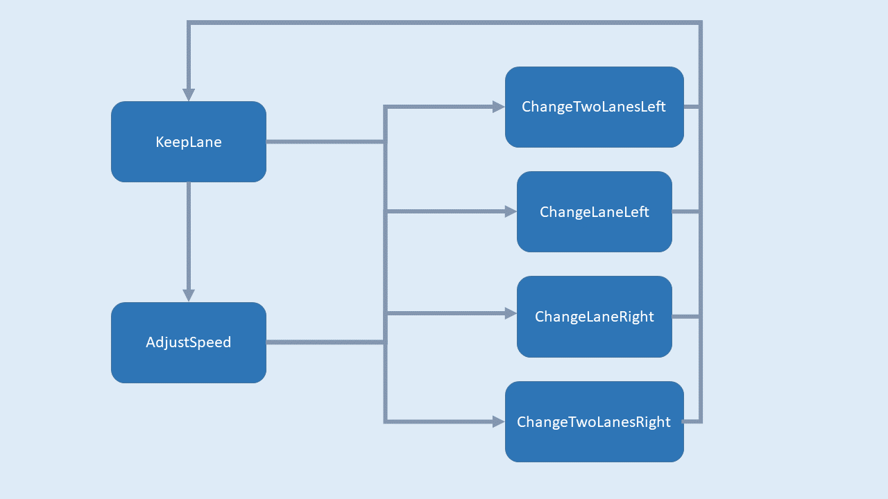
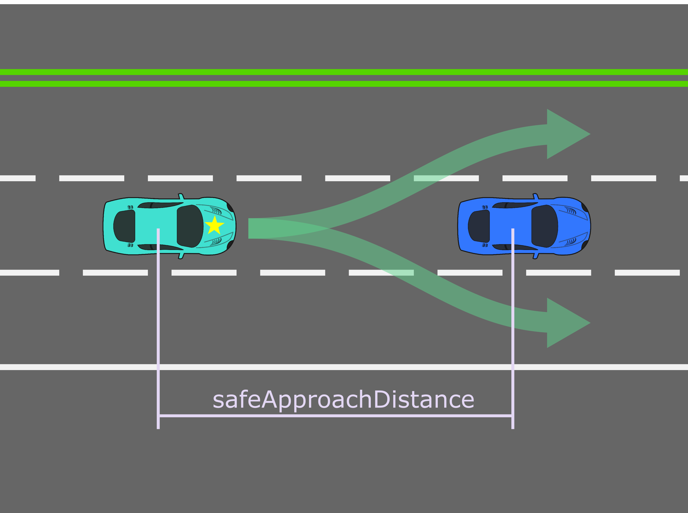
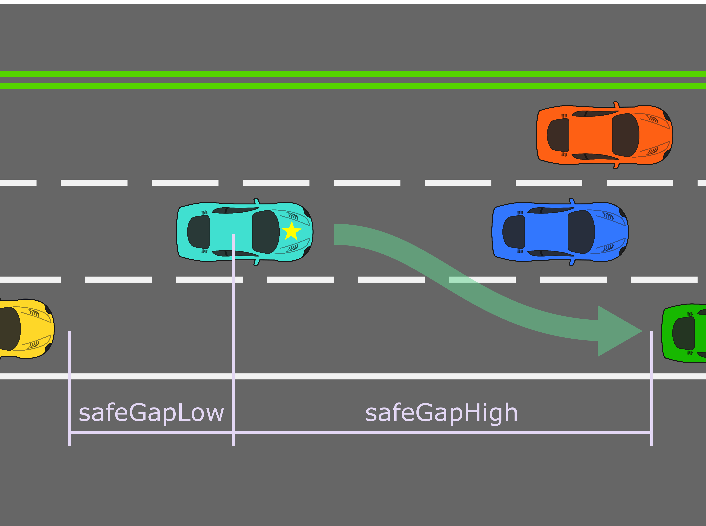
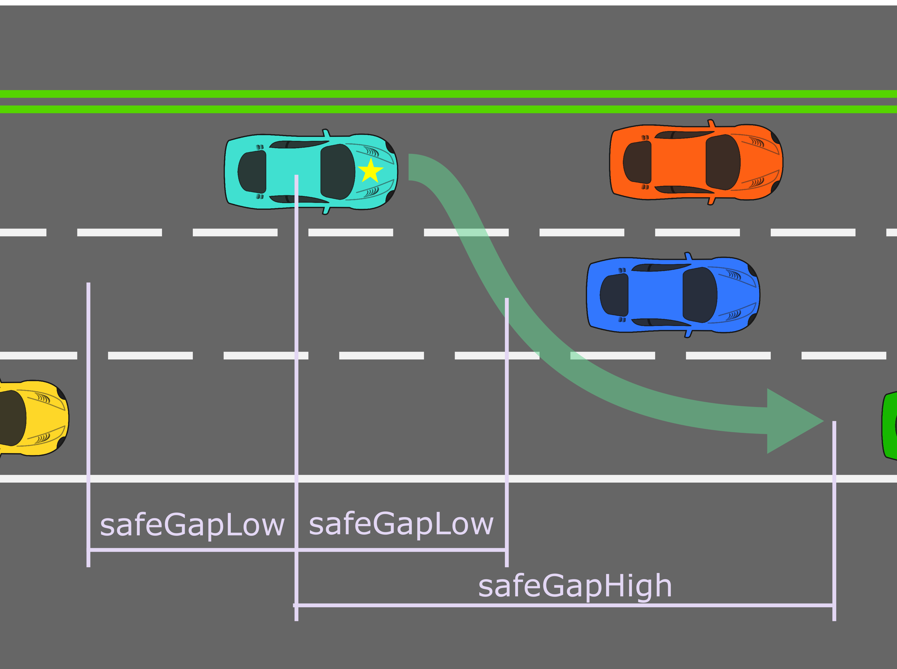

# CarND-Path-Planning-Project
Self-Driving Car Engineer Nanodegree Program

### Goals
In this project your goal is to safely navigate around a virtual highway with other traffic that is driving +-10 MPH of the 50 MPH speed limit. You will be provided the car's localization and sensor fusion data, there is also a sparse map list of waypoints around the highway. The car should try to go as close as possible to the 50 MPH speed limit, which means passing slower traffic when possible, note that other cars will try to change lanes too. The car should avoid hitting other cars at all cost as well as driving inside of the marked road lanes at all times, unless going from one lane to another. The car should be able to make one complete loop around the 6946m highway. Since the car is trying to go 50 MPH, it should take a little over 5 minutes to complete 1 loop. Also the car should not experience total acceleration over 10 m/s^2 and jerk that is greater than 50 m/s^3.

### Following the lane
As a first step the car has to be able to follow one lane. The simulator provides the car's position in cartesian coordinates as well as in frenet coordinates. Frenet coordinates describe the position of the car with two values, *s* is the distance along the streets central path and *d* is the distance perpendicular to the central path. Hence, if the car shall stay in one lane the *d* value is constant and the position of the car is described with just one variable parameter *s*. The central path of the road is defined with waypoints in cartesian coordinates in the file *data/highway_map.csv*. The methods *getFrenet* and *getXY* transform coordinates from one of these two systems to the other. However, driving from one waypoint to the next in a straight line doesn't lead to a continuous path. Every time the car reaches one waypoint and changes its orientation towards the next waypoint, it will experience an infinite acceleration. Therefore the waypoints have to be interpolated. One way to do so is using spline interpolation which creates a polynomial out of some anchor points. The polynomial minimizes the first and second derivative and goes through the anchor points. Using the current *s* position and the position in 30, 60 and 90 m as anchor points creates a path smooth enough to not exceed the acceleration limit and accurate enough to stay in the lane.

 The implementation for the spline interpolation used in this project can be downloaded at http://kluge.in-chemnitz.de/opensource/spline/spline.h .

### Planning the path
The other cars in the simulator are designed to be slightly slower than 50 mph. Therefore a strategy for overtaking maneuvers is needed. The class *DecisionMaker* provides the logic for each evaluation cycle summarized in the method *Decide*. *DecisionMaker* is implemented as finite-state machine, hence it will decide accordingly to the current state. The return value of *Decide* is a state defined in *State.h*. Since one evalution cycle takes only 0.02 s, most of the time the returned state will be the current state and the car will continue with its defined behavior. The following six states are used in this project:



#### *ST_KEEPLANE*
The car will keep the current lane and will proceed with a velocity of 49.5 mph.

#### *ST_ADJUSTSPEED*
The car has encountered a slower vehicle within its lane and it is not safe to overtake. The car will stay in its lane and match the slower vehicles speed until it is safe to overtake.

#### *ST_CHANGELANELEFT* and *ST_CHANGELANERIGHT*
The car will change to the next left or right lane in order to overtake a slower vehicle.

#### *ST_CHANGETWOLANESLEFT* and *ST_CHANGETWOLANESRIGHT*
The car will change to the lane after the next lane - to the left or the right. The reason for these states is one particular situation in which the car is in the most left or right lane and encounters two slower vehicles with the same or very similar velocity, one in its own lane and one in the center lane. Given the previous states it will never be safe to overtake because the next lane is blocked. Therefore the car will count the time in which it stays in the state ST_ADJUSTSPEED. After an adjustable patience time limit the car will consider a lane change over two lanes.

#### Safety distances
All decisions are based on distances between the car and other vehicles in the simulation. *DecisionMaker* differs between the following three safety distances:

  * __safeApproachDistance__: The car will check this distance in front of itself while the state *ST_KEEPLANE*. When another vehicles appears witihin this distance the state machine has to decide to change the lane or to reduce the speed.



  * __safeGapHigh__: The car will check this distance in front of itself on the next left or right lane while considering a lane change.
  * __safeGapLow__: The car will check this distance behind itself on the next left or right lane while considering a lane change.



For lane changes over two lanes the car will check *safeGapLow* in the front and the back of the center lane. The lane after the next lane will be checked like in a single lane change.



The following parameters were used to initialize the DecisionMaker:

| Parameter            | Value         | Unit  |
| -------------------- |:-------------:|:-----:|
| safeApproachDistance | 30            | m     |
| safeGapHigh          | 35            | m     |
| safeGapLow           | 5             | m     |
| patience             | 10            | s     |

---

### Simulator.
The Term3 Simulator used in this project can be downloaded from the [releases tab (https://github.com/udacity/self-driving-car-sim/releases).

## Basic Build Instructions

1. Clone this repo.
2. Make a build directory: `mkdir build && cd build`
3. Compile: `cmake .. && make`
4. Run it: `./path_planning`.

## Dependencies

* cmake >= 3.5
 * All OSes: [click here for installation instructions](https://cmake.org/install/)
* make >= 4.1
  * Linux: make is installed by default on most Linux distros
  * Mac: [install Xcode command line tools to get make](https://developer.apple.com/xcode/features/)
  * Windows: [Click here for installation instructions](http://gnuwin32.sourceforge.net/packages/make.htm)
* gcc/g++ >= 5.4
  * Linux: gcc / g++ is installed by default on most Linux distros
  * Mac: same deal as make - [install Xcode command line tools]((https://developer.apple.com/xcode/features/)
  * Windows: recommend using [MinGW](http://www.mingw.org/)
* [uWebSockets](https://github.com/uWebSockets/uWebSockets)
  * Run either `install-mac.sh` or `install-ubuntu.sh`.
  * If you install from source, checkout to commit `e94b6e1`, i.e.
    ```
    git clone https://github.com/uWebSockets/uWebSockets 
    cd uWebSockets
    git checkout e94b6e1
    ```
